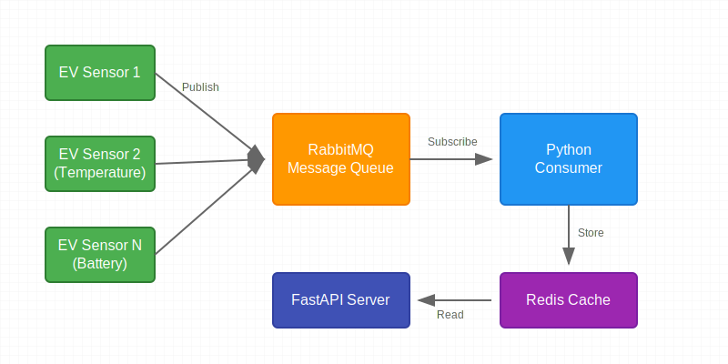

# Electric Vehicle Sensor Data Processing System

A scalable system for processing and storing electric vehicle sensor data using RabbitMQ for message queuing, Python for data processing, Redis for data storage, and FastAPI for data retrieval.

## 🚗 System Architecture

<div align="center">
  
</div>

## 🏗️ Project Structure

```
backend/
├── docker-compose.yml          # Docker services configuration
├── .gitignore                 # Git ignore rules
├── README.md                  # This file
├── Dockerfile                 # Backend service container config
├── requirements.txt           # Python dependencies
├── src/
│   ├── __init__.py
│   ├── main.py               # FastAPI application
│   ├── consumer.py           # RabbitMQ consumer for sensor data
│   ├── config.py             # Configuration settings
│   ├── api/
│   │   ├── __init__.py
│   │   ├── routes/
│   │   │   ├── __init__.py
│   │   │   └── v1.py        # API endpoints
│   │   └── models/
│   │       ├── __init__.py
│   │       └── schemas.py    # Data models
│   └── services/
│       ├── __init__.py
│       ├── redis_service.py  # Redis client wrapper
│       └── rabbitmq_service.py # RabbitMQ client wrapper
└── tests/
    ├── __init__.py
    ├── test_api.py
    └── test_services.py
```

## 🔄 Data Flow

1. **Data Collection**

   - Multiple EV sensors publish data directly to RabbitMQ
   - Each sensor can publish different types of data (temperature, battery, speed, etc.)
   - Publishers use direct exchange with specific routing keys for different data types

2. **Data Processing**

   - Python consumer subscribes to relevant queues
   - Processes incoming sensor data
   - Stores processed data in Redis
   - Handles different data types appropriately

3. **Data Storage**

   - Redis stores the latest sensor data
   - Uses appropriate data structures for different types of data
   - Implements TTL (Time To Live) for data expiration if needed

4. **Data Retrieval**
   - FastAPI provides REST endpoints to retrieve sensor data
   - Supports filtering and querying based on sensor types
   - Returns data in standardized JSON format

## 🚀 Quick Start

### Prerequisites

- Docker and Docker Compose
- Python 3.11 or higher (for local development)
- Available ports:
  - 5672 (RabbitMQ)
  - 15672 (RabbitMQ Management)
  - 6379 (Redis)
  - 8000 (FastAPI)

### Installation

1. Clone the repository:

```bash
git clone <repository-url>
cd backend
```

2. Start all services using Docker Compose:

```bash
docker-compose up --build
```

### 🔌 Publishing Sensor Data

Publishers should use the following format when sending data to RabbitMQ:

```json
{
  "sensor_id": "ev_001",
  "sensor_type": "battery",
  "timestamp": "2024-02-01T12:00:00Z",
  "value": 85.5,
  "unit": "percentage"
}
```

Example routing keys:

- `ev.sensor.battery`
- `ev.sensor.temperature`
- `ev.sensor.speed`

### 📡 API Endpoints

#### Get Latest Sensor Data

```http
GET /api/v1/sensor/{sensor_id}
```

#### Get Specific Sensor Type Data

```http
GET /api/v1/sensor/{sensor_id}/{sensor_type}
```

#### Get Historical Data (if implemented)

```http
GET /api/v1/sensor/{sensor_id}/history?start_time={start}&end_time={end}
```

## 🔧 Configuration

### Environment Variables

| Variable      | Description          | Default   |
| ------------- | -------------------- | --------- |
| REDIS_HOST    | Redis server host    | localhost |
| REDIS_PORT    | Redis server port    | 6379      |
| RABBITMQ_HOST | RabbitMQ server host | localhost |
| RABBITMQ_PORT | RabbitMQ server port | 5672      |
| RABBITMQ_USER | RabbitMQ username    | user      |
| RABBITMQ_PASS | RabbitMQ password    | password  |

## 💾 Data Storage Patterns

### Redis Key Patterns

- Latest sensor readings: `sensor:{sensor_id}:{sensor_type}:latest`
- Historical data: `sensor:{sensor_id}:{sensor_type}:history`
- Aggregated data: `sensor:{sensor_id}:summary`

## 🔍 Monitoring

### RabbitMQ Management Interface

- URL: `http://localhost:15672`
- Default credentials:
  - Username: user
  - Password: password
- Monitor:
  - Queue sizes
  - Message rates
  - Consumer status

### Application Monitoring

- Health check endpoint: `GET /health`
- Consumer logs in Docker logs
- API request logs

## 🔒 Security Considerations

- Implement proper authentication for API endpoints
- Use SSL/TLS for RabbitMQ connections in production
- Secure Redis with password in production
- Implement rate limiting for API endpoints
- Use appropriate network segmentation in production

## 🚦 Error Handling

The system handles various error scenarios:

- Lost connections to RabbitMQ/Redis
- Invalid sensor data format
- Storage failures
- API request errors

## 🔬 Testing

Run the test suite:

```bash
# Install test dependencies
pip install -r requirements.txt

# Run tests
python -m pytest tests/
```

## 📊 Performance Considerations

- Redis data expiration policies
- Message queue persistence settings
- Consumer prefetch settings
- API response caching
- Database connection pooling

## 🛠️ Development

### Local Setup

1. Create virtual environment:

```bash
python -m venv venv
source venv/bin/activate  # On Windows: venv\Scripts\activate
```

2. Install dependencies:

```bash
pip install -r requirements.txt
```

3. Run services locally:

```bash
# Terminal 1: Run FastAPI
uvicorn src.main:app --reload --port 8000

# Terminal 2: Run Consumer
python -m src.consumer
```

## 📝 License

[Your License Here]

## 🤝 Contributing

1. Fork the repository
2. Create feature branch (`git checkout -b feature/amazing-feature`)
3. Commit changes (`git commit -m 'Add amazing feature'`)
4. Push to branch (`git push origin feature/amazing-feature`)
5. Open Pull Request
